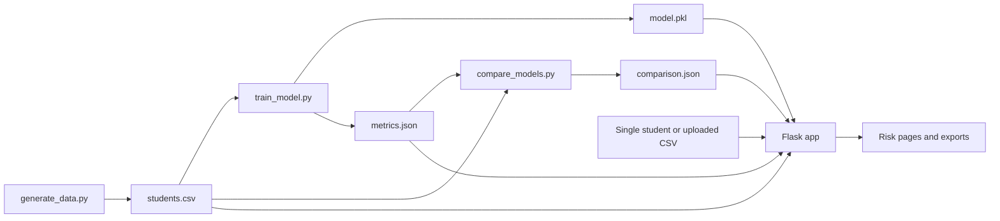

# LMS At-Risk Student Prediction System

## Concept and purpose

This project estimates the probability that a student may be at risk, using activity that a learning management system (LMS) could record: logins, session time, scores, late work, missed deadlines, forum activity, and time since the last login. A teacher can check one student, review a scored group, or upload a CSV. The result is a **support signal**, not a diagnosis or an automatic decision about a student.

The current dataset is simulated. `generate_data.py` makes plausible activity values, derives a hidden risk score from them, adds noise, and samples the `at_risk` label. Consequently, test results demonstrate the method on this simulated population. They do not establish performance on real students or prove that any activity causes a student to be at risk.

## Data and artifacts

| Feature | Meaning | Accepted input |
| --- | --- | --- |
| `logins_per_week` | Average LMS logins each week | Number from 0 to 14 |
| `avg_session_min` | Average session length in minutes | Number from 0 to 120 |
| `avg_quiz_score` | Average quiz score | Number from 0 to 100 |
| `avg_assignment_score` | Average assignment score | Number from 0 to 100 |
| `late_submission_rate` | Fraction of submissions that were late | Number from 0 to 1 |
| `missed_deadlines` | Count of missed deadlines | Whole number, 0 or more |
| `forum_posts` | Count of forum posts | Whole number, 0 or more |
| `days_since_last_login` | Time since the last LMS login | Number, 0 or more |

`students.csv` contains these eight features and `at_risk`, where `1` means the simulated student was at risk and `0` means not at risk. `student_id` is optional for uploads; the app generates IDs such as `S001` when it is absent. The saved `model.pkl` contains a dictionary with `model` and `features`. The `features` list is the authority for **prediction column order**. `metrics.json` stores the deployed model's training evaluation; `comparison.json` stores the separate four-model comparison. Neither JSON file is a source of student predictions.



## How the training data is made

`generate_data.py` uses a fixed random seed (`42`) to produce 1,500 simulated rows. It draws activity values from normal, beta, Poisson, and exponential distributions, then clips or rounds them to sensible ranges. Its hidden risk score gives lower risk for more logins, longer sessions, higher scores, and more forum posts; it gives higher risk for late submissions, missed deadlines, and longer gaps since login. It standardizes that score, adds random noise, converts it through a logistic function, then samples each `at_risk` label. The added noise means students with similar activity need not have identical labels.

Running `generate_data.py` **replaces** `students.csv`. The ordinary web app does not regenerate data.

## Training and evaluation algorithm

1. `train_model.py` reads `students.csv` and selects the eight features as `X`; `at_risk` is the target `y`.
2. It makes a stratified 80/20 train/test split with `random_state=42`. For 1,500 rows, that is 1,200 training and 300 test rows. Stratification keeps the class proportions similar in both groups.
3. `GridSearchCV` tries Random Forest settings for `n_estimators` (100, 200, 300), `max_depth` (5, 10, unlimited), and `min_samples_split` (2, 5, 10). It uses five-fold cross-validation on the **training** split and chooses settings by recall for the at-risk class. The classifier uses `class_weight="balanced"` and `random_state=42`.
4. The selected model predicts the held-out test rows. `metrics.json` records accuracy, precision, recall, F1, ROC-AUC, a 2×2 confusion matrix, feature importances, chosen settings, dataset sizes, and a timestamp. It also records mean five-fold accuracy on the full dataset.
5. The same model is saved to `model.pkl` as `{"model": ..., "features": [...]}`. Predict and Dashboard load this bundle at app startup. Retraining can change their results, so restart the app after running `train_model.py`.

For the confusion matrix, **TN** is correctly identified not-at-risk students, **FP** is false alerts, **FN** is missed at-risk students, and **TP** is correctly identified at-risk students. Accuracy is `(TP + TN) / all test rows`; precision is `TP / (TP + FP)`; recall is `TP / (TP + FN)`; and F1 combines precision and recall. ROC-AUC measures how well risk scores rank at-risk students above others across thresholds. Recall matters particularly here because a missed student may lose an opportunity for support. Precision still matters because false alerts consume attention.

## Prediction algorithm

The app validates the eight entered values, constructs a DataFrame in `model.pkl["features"]` order, and uses `model.predict_proba(row)[0, 1]`. Column `1` is the model's probability for the at-risk class. The risk badge uses this separate three-level rule:

| Probability | Displayed level |
| --- | --- |
| Below `0.33` | Low |
| `0.33` to below `0.66` | Medium |
| `0.66` or above | High |

These bands organize the display. When an uploaded CSV includes real `at_risk` labels, the Dashboard's **Model vs your labels** check instead uses probability `>= 0.5` to make a binary prediction, then calculates its confusion matrix, accuracy, precision, recall, and F1. The two thresholds serve different purposes.

For a group, `score_students` passes the entire feature DataFrame to `predict_proba` once, calculates each probability and level, and sorts the Dashboard by highest probability. Cards summarize all rows; filter buttons choose a level; pagination shows 25 matching rows at a time. The optional `at_risk` label is never substituted for the model's predicted level.

## How the explanations work

`explain.py` reads `students.csv` at startup and takes the median of each feature among rows labeled `at_risk = 0`. This is the **reference profile** of a typical simulated on-track student. For a student with original predicted risk probability `p`, the app replaces one feature with its reference median and predicts again. Its contribution, in percentage points, is:

`contribution = (original probability − probability after replacement) × 100`

A positive contribution means the original value raised the model's risk score relative to that one-feature replacement. A negative value means it lowered the score. The function creates eight modified copies of the whole student batch and calls `predict_proba` eight times, once per feature, rather than eight times per student. It reports up to three **drivers** with contributions of at least 2 points and up to two **strengths** that lower risk by at least 2 points. The Predict page shows their sizes; the Dashboard shows short driver text and expandable details.

This is a model sensitivity test, **not a causal explanation**. Features can interact, so the contributions should not be added to reconstruct the whole risk probability. The reference comes from simulated labels, which is another reason to avoid treating these explanations as findings about real students.

## Model comparison

`compare_models.py` uses the same stratified 80/20 split and seed as training. It fits Logistic Regression (with scaling), K-Nearest Neighbors (with scaling and five-fold recall tuning for `k`), a Decision Tree (with five-fold recall tuning for depth), and a Random Forest using `metrics.json`'s chosen settings. It evaluates each on the held-out 300 rows using accuracy, precision, recall, F1, and ROC-AUC. It also measures five-fold ROC-AUC on the full dataset and records fitting time. It writes `comparison.json` without changing `model.pkl` or `train_model.py`.

The Model Comparison page highlights the best value in each metric, marks Random Forest as deployed, and generates its takeaway from the JSON numbers. Model Performance is different: it describes the deployed Random Forest's own training report from `metrics.json`. Small differences between methods on these simulated labels are not strong evidence for which would work best in a real LMS.

## Pages, uploads, and exports

| Page or route | Purpose |
| --- | --- |
| `/predict` | Validate one student's eight values, predict risk, and explain the result. `/` redirects here. |
| `/dashboard` | Show scored sample or session-uploaded students, summary cards, filters, pagination, and optional label check. |
| `/upload` and `/sample.csv` | Accept an uploaded CSV or download a small example. |
| `/model-performance` | Display `metrics.json` or a friendly instruction if it is missing. |
| `/model-comparison` | Display `comparison.json` or a friendly instruction if it is missing. |
| `/download-results` | Export all rows matching the active Dashboard level filter, with a UTF-8 BOM for Excel. |
| `/report` | Show a print-friendly summary and top 20 students; the browser's **Print / Save as PDF** button produces a PDF. |

Uploads accept CSV files up to 2 MB and 5,000 rows. Column names are trimmed and matched without case sensitivity. The app reports missing columns, missing or non-numeric values, and invalid whole-number or optional label values. The user can skip affected rows or reject the file. Numeric values outside valid ranges are clamped, with the number of adjustments reported. A valid upload is scored and saved under a random UUID name in `uploads/`; only that ID goes into the signed Flask session cookie. Files older than one hour are removed when a new upload starts. The Dashboard uses the upload for that session until **Use sample data instead** clears the ID. The default `students.csv` view is cached at startup, so restart the app to pick up changes to that file.

The CSV export includes student ID, all eight features, risk probability as a percent, risk level, explanation driver text, and `at_risk` if available. The report uses the current session's data, summary counts, distribution bar, top 20 rows, and headline metrics from `metrics.json`. It has no navbar and relies on the browser's print dialog for PDF output; the project does not include a PDF generation package.

## Run and refresh order

From the project folder with the virtual environment active:

```powershell
# Only when you intentionally want to replace the simulated dataset:
python generate_data.py

# Trains and overwrites model.pkl and metrics.json:
python train_model.py

# Updates comparison.json without replacing the deployed model:
python compare_models.py

# Starts the Flask site at http://127.0.0.1:5000:
python app.py
```

For ordinary use with existing artifacts, run only `python app.py`. Restart it after changing `students.csv` or `model.pkl`; the model, on-track reference, and default Dashboard data are loaded at startup. Model Performance and Model Comparison read their JSON reports when requested. Set `FLASK_SECRET_KEY` to a private value outside local development so uploaded-data session cookies are protected.
